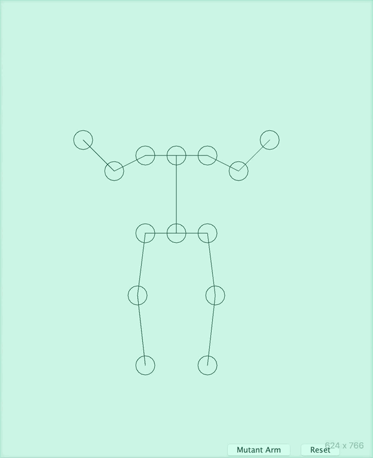

# Inverse-Kinematics

A basic human body whose joints can be dragged by the user's mouse. 

Simplifying a little, we can think of the body as a tree of Joints and each Joint has a translation operation (in the form of a matrix) that represents it's 2D vector from it's parent in the body tree. 
The root of the body tree is the pelvis, which has two children the left hip and the right hip. The left hip itself has two children, the left knee and the left shoulder. And so on. 
Drawing is just finding the locations of each Joint by traversing the body tree while keeping track of the joint's parent location and applying (by matrix multiplication) the joint's translation operation on that parent location. 

Adding in inverse kinematics, we instead think of the body as a tree of Links. A Link is a linked list of joints (such as hip joint, knee joint, foot joint) and the translation matrix of the first joint in each Link does not change to preserve torso body structure. The exception is that the length-one Link containing the pelvis joint changes it's translation matrix when we want to translate the entire body. 

Each link has the following property:
Joints further down in a Link (such as the foot joint) can change the transformations of joints further up in the Link (such as the knee joint) but not vis versa.
These changes are determined by FABRIK (inverse kinematics) when the user drags a joint to a new location. 

Some future goals include simulating walking, allowing user-chosen movements to persist as data that can be "replayed", or setting key positions and interpolating between them to create fluid motion. 

